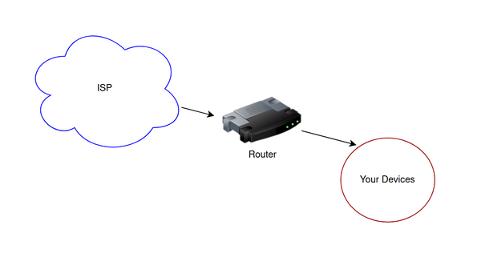

# ipv6thingy 

You have a [Linux router](https://evuraan.info/evuraan/stuff/bufferbloat.html), it has been working great with IPv4. 

 
Your predatory ISP is <i>now</i> IPv6 capable and you are looking to extend IPv6 to your devices.  

<b>ipv6thingy</b> will help setup your Linux v6 gateway. 

### Pre-reqs
We need `radvd` and `dhclient`. On my Debian I installed those as:

<pre>
$ sudo apt-get install isc-dhcp-client radvd
</pre>

### Config file 
`/etc/ipv6thingy.conf` is the config file we use. Setup your config based on the [`ipv6thingy.conf`](https://github.com/evuraan/ipv6thingy/blob/master/ipv6thingy.conf) provided.

`internal` is your NIC which faces your internal devices. 

`external` is the NIC which interacts with your ISP.

Optionally, if you wish to limit IPv6 to a select few devices in your Network, you should list their link local addresses:

<pre>
enable fe80::fa3b:514c:1133:50fc	# tableFan
enable fe80::fa3b:524c:1233:50ac	# kitchenSink
enable fe80::fa3b:534c:1123:50bc	# dishwasher
enable fe80::fa3b:524c:1232:50bc	# porchlights
</pre>

If there are no link local addresses listed, radvd will use multicast router advertisements to all your devices.

#### Optional - Build 
If you prefer to create your own binaries, you can compile those by running `make.sh`. 
<pre>
$ ./make.sh
..
</pre>
You will need the [Go Programming Language](https://golang.org/dl/) installed on your System.

### Set it up
Please ensure your config file `/etc/ipv6thingy.conf` is in place and pre-reqs have been installed. 

Let's set it up by running `setup.sh` as:
<pre>
$ sudo ./setup.sh 
'ipv6thingy.service' -> '/etc/systemd/system/ipv6thingy.service'
'bin/ipv6thingy-armv7l' -> '/usr/local/bin/ipv6thingy'
'ipv6hook' -> '/etc/dhcp/dhclient-exit-hooks.d/ipv6hook'
.. /snip/ .. 
</pre>

If everything goes well, your devices should have IPv6 addresses by now. 

Navigate to http://ipv6.bieringer.de/ or  https://test-ipv6.comcast.net/ to verify. 

### Status Check
Check the status of service `ipv6thingy`: 
<pre>
$ sudo systemctl status  ipv6thingy
● ipv6thingy.service - ipv6thingy
   Loaded: loaded (/etc/systemd/system/ipv6thingy.service; enabled; vendor preset: enabled)
   Active: active (running) since Sun 2020-08-16 11:36:50 PDT; 2h 9min ago
 Main PID: 608 (ipv6thingy)
   CGroup: /system.slice/ipv6thingy.service
           ├─608 /usr/local/bin/ipv6thingy --daemon
           └─668 dhclient -6 -P -d -v eth1
    ../snip/..
</pre>

You can also inspect your daemon's log:
<pre>
$ sudo journalctl -u  ipv6thingy -f
-- Logs begin at Thu 2016-11-03 10:16:42 PDT. --
Aug 16 12:54:15 claypi ipv6thingy[608]: Packet received, but nothing done with it.
Aug 16 12:54:15 claypi dhclient[668]: Packet received, but nothing done with it.
Aug 16 13:11:31 claypi dhclient[668]: RCV: Advertise message on eth1 from fe80:: 
../snip/..
</pre>

## How does it work?

The `ipv6thingy` daemon launches `dhclient` on your external interface, looking for IPv6 Prefix from your ISP. 

The details will be written out to `/var/lib/dhcp/dhclient6.leases` file. 

Upon dhcp events, `ipv6hook` hooks into `ipv6thingy` which populates `/etc/radvd.conf` and restart `radvd` as appropriate. 

It also takes care of the `sysctl` and routing operations as required. 

<pre>
$ sudo grep ipv6 /var/log/daemon.log
Aug 16 18:39:55 claypi systemd[1]: Started ipv6thingy.
Aug 16 18:39:55 claypi ipv6thingy[623]: ipv6Thingy 1.4g Copyright (C) 2020 Evuraan <evuraan@gmail.com>
Aug 16 18:39:55 claypi ipv6thingy[623]: This program comes with ABSOLUTELY NO WARRANTY.
Aug 16 18:39:55 claypi ipv6thingy[623]: Daemon!
Aug 16 18:39:55 claypi ipv6thingy[623]: net.ipv6.conf.eth1.accept_ra = 2
Aug 16 18:39:55 claypi ipv6thingy[623]: net.ipv6.conf.eth1.forwarding = 0
Aug 16 18:39:55 claypi ipv6thingy[623]: Internet Systems Consortium DHCP Client 4.3.5
Aug 16 18:39:55 claypi ipv6thingy[623]: Copyright 2004-2016 Internet Systems Consortium.
Aug 16 18:39:55 claypi ipv6thingy[623]: All rights reserved.
Aug 16 18:39:55 claypi ipv6thingy[623]: For info, please visit https://www.isc.org/software/dhcp/
Aug 16 18:39:56 claypi ipv6thingy[623]: ipv6Thingy 1.4g Copyright (C) 2020 Evuraan <evuraan@gmail.com>
Aug 16 18:39:56 claypi ipv6thingy[623]: This program comes with ABSOLUTELY NO WARRANTY.
Aug 16 18:39:56 claypi ipv6thingy[623]: Helper - reason: PREINIT6, Iface: eth1
Aug 16 18:39:56 claypi ipv6thingy[623]: Ignoring - reason PREINIT6 not valid
Aug 16 18:39:56 claypi ipv6thingy[623]: Listening on Socket/eth1
Aug 16 18:39:56 claypi ipv6thingy[623]: Sending on   Socket/eth1
Aug 16 18:39:56 claypi ipv6thingy[623]: PRC: Confirming active lease (INIT-REBOOT).
Aug 16 18:39:56 claypi ipv6thingy[623]: XMT: Forming Rebind, 0 ms elapsed.
Aug 16 18:39:56 claypi ipv6thingy[623]: XMT:  X-- IA_PD OBFUSCATED
Aug 16 18:39:56 claypi ipv6thingy[623]: XMT:  | X-- Requested renew  +3600
Aug 16 18:39:56 claypi ipv6thingy[623]: XMT:  | X-- Requested rebind +5400
Aug 16 18:39:56 claypi ipv6thingy[623]: XMT:  | | X-- IAPREFIX 2601:OBFUSCATED:123::/64
Aug 16 18:39:56 claypi ipv6thingy[623]: XMT:  | | | X-- Preferred lifetime +7200
Aug 16 18:39:56 claypi ipv6thingy[623]: XMT:  | | | X-- Max lifetime +7500
Aug 16 18:39:56 claypi ipv6thingy[623]: XMT:  V IA_PD appended.
Aug 16 18:39:56 claypi ipv6thingy[623]: XMT: Rebind on eth1, interval 1090ms.
Aug 16 18:39:56 claypi ipv6thingy[623]: RCV: Reply message on eth1 from fe80::OBFUSCATED
Aug 16 18:39:56 claypi ipv6thingy[623]: RCV:  X-- IA_PD 5e:OBFUSCATED:ec
Aug 16 18:39:56 claypi ipv6thingy[623]: RCV:  | X-- starts 1597628396
Aug 16 18:39:56 claypi ipv6thingy[623]: RCV:  | X-- t1 - renew  +105260
Aug 16 18:39:56 claypi ipv6thingy[623]: RCV:  | X-- t2 - rebind +168416
Aug 16 18:39:56 claypi ipv6thingy[623]: RCV:  | X-- [Options]
Aug 16 18:39:56 claypi ipv6thingy[623]: RCV:  | | X-- IAPREFIX 2OBFUSCATED::/64
Aug 16 18:39:56 claypi ipv6thingy[623]: RCV:  | | | X-- Preferred lifetime 210520.
Aug 16 18:39:56 claypi ipv6thingy[623]: RCV:  | | | X-- Max lifetime 210520.
Aug 16 18:39:56 claypi ipv6thingy[623]: RCV:  X-- Server ID: 00:01:00OBFUSCATED
Aug 16 18:39:56 claypi ipv6thingy[623]: PRC: Bound to lease 00:01:00OBFUSCATED
Aug 16 18:39:57 claypi ipv6thingy[623]: ipv6Thingy 1.4g Copyright (C) 2020 Evuraan <evuraan@gmail.com>
Aug 16 18:39:57 claypi ipv6thingy[623]: This program comes with ABSOLUTELY NO WARRANTY.
Aug 16 18:39:57 claypi ipv6thingy[623]: Helper - reason: REBIND6, Iface: eth1
Aug 16 18:39:57 claypi ipv6thingy[623]: Wrote 686 bytes to /tmp/temp-1597628397214453514
Aug 16 18:39:57 claypi ipv6thingy[623]: [Aug 16 18:39:57] radvd (725): config file, /tmp/temp-1597628397214453514, syntax ok
Aug 16 18:39:57 claypi ipv6thingy[623]: Copied 686 bytes from /etc/radvd.conf to /etc/backup-radvd-1597628397214453514
Aug 16 18:39:57 claypi ipv6thingy[623]: Backup: /etc/radvd.conf saved as /etc/backup-radvd-1597628397214453514
Aug 16 18:39:57 claypi ipv6thingy[623]: Copied 686 bytes from /tmp/temp-1597628397214453514 to /etc/radvd.conf
Aug 16 18:39:57 claypi ipv6thingy[623]: running: ip -6 route add 2OBFUSCATED/64 dev eth0
Aug 16 18:39:57 claypi ipv6thingy[623]: radvd restarted OK
Aug 16 18:39:57 claypi ipv6thingy[623]: PRC: Renewal event scheduled in 105259 seconds, to run for 63156 seconds.
Aug 16 18:39:57 claypi ipv6thingy[623]: PRC: Depreference scheduled in 210519 seconds.
Aug 16 18:39:57 claypi ipv6thingy[623]: PRC: Expiration scheduled in 210519 seconds.
</pre>

## Troubleshooting

### I don't see IPv6 broadcasts from my ISP..
Yes, this is a common problem! 

On your External interface, please be sure to allow UDP traffic to/from port 546 from port 547. 

On my UFW, I use:
<pre>
ufw allow out on eth1  from fe00::/7 port 546 to fe00::/7 port 547  proto udp 
</pre>

## Disabling ipv6thingy

- Disable/delete the service `ipv6thingy`
- Delete `ipv6hook` file 
<pre>
$ sudo systemctl disable ipv6thingy
$ sudo rm -v /etc/dhcp/dhclient-exit-hooks.d/ipv6hook
</pre>

## References
- https://www.tldp.org/HOWTO/Linux+IPv6-HOWTO/ch07s04.html
- https://baldnerd.com/send_packet6-operation-not-permitted/
- https://www.phildev.net/phil/blog/?p=308
- https://github.com/jaymzh/v6-gw-scripts
- https://evuraan.info/evuraan/stuff/bufferbloat.html

